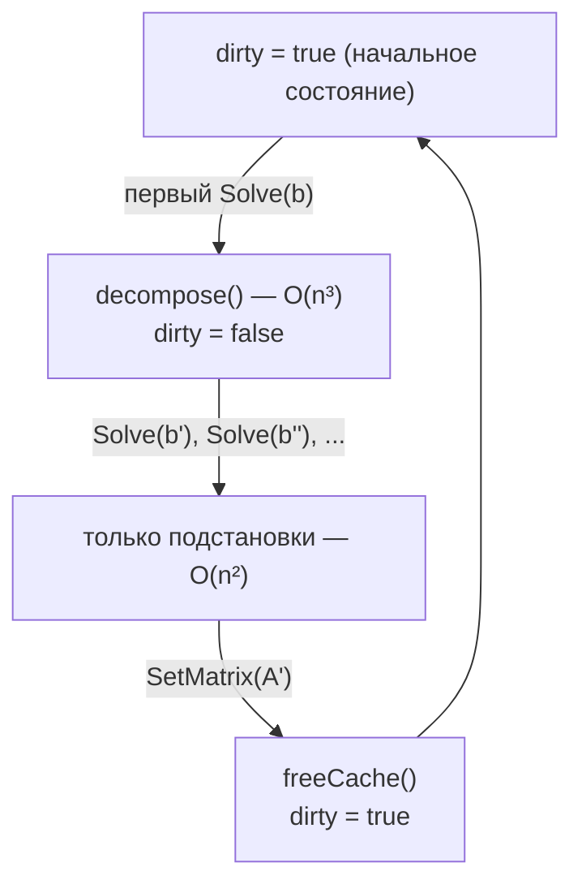

## 1. Квадратная матрица и нормы

Квадратная матрица порядка $n$ — прямоугольная таблица из $n \times n$ элементов:

$$
A = \begin{pmatrix}
a_{00} & a_{01} & \cdots & a_{0,n-1} \\
a_{10} & a_{11} & \cdots & a_{1,n-1} \\
\vdots & \vdots & \ddots & \vdots \\
a_{n-1,0} & a_{n-1,1} & \cdots & a_{n-1,n-1}
\end{pmatrix}
$$

Элементы хранятся в порядке **row-major**: элемент $a_{ij}$ находится
по индексу $i \cdot n + j$ во внутреннем одномерном массиве.

### Норма Фробениуса

Норма Фробениуса измеряет «размер» матрицы:

$$
\|A\|_F = \sqrt{\sum_{i=0}^{n-1} \sum_{j=0}^{n-1} |a_{ij}|^2}
$$

Для вещественных элементов $|a_{ij}|^2 = a_{ij}^2$;
для комплексных $|a_{ij}|^2 = \mathrm{Re}(a_{ij})^2 + \mathrm{Im}(a_{ij})^2$.

В коде вычисляется методом `Norm()` с помощью вспомогательной функции
`normSqOf(x)`, возвращающей $|x|^2$ как для `double`, так и для `Complex`.

---

## 2. Элементарные преобразования строк и столбцов

Поддерживаются три элементарных преобразования строк:

| Операция | Обозначение | Действие |
|---|---|---|
| Перестановка строк | $R_i \leftrightarrow R_j$ | Поменять строки $i$ и $j$ местами |
| Умножение строки | $R_i \leftarrow \lambda R_i$ | Умножить строку $i$ на скаляр $\lambda$ |
| Прибавление строки | $R_i \leftarrow R_i + \lambda R_j$ | Прибавить $\lambda$-кратную строку $j$ к строке $i$ |

Те же три операции применяются к столбцам ($C_i$).

### Семантика Mutable и Immutable

- **Mutable**: операция изменяет матрицу на месте и возвращает `this`.
- **Immutable**: операция создает глубокую копию, изменяет копию и
  возвращает ее; оригинал остается нетронутым.

Оба поведения реализованы в одном коде через полиморфный метод `Instance()`:

$$
\text{Instance()} = \begin{cases}
\texttt{this} & \text{Mutable} \\
\texttt{Clone()} & \text{Immutable}
\end{cases}
$$

---

## 3. Система линейных уравнений

Решается система $n \times n$:

$$
Ax = b, \quad A \in \mathbb{F}^{n \times n},\; b \in \mathbb{F}^n,\;
x \in \mathbb{F}^n
$$

где $\mathbb{F}$ — либо $\mathbb{R}$ (`double`), либо $\mathbb{C}$ (`Complex`).

### Невязка

Качество приближенного решения $\tilde{x}$ измеряется нормой **невязки**:

$$
r = \|A\tilde{x} - b\|_2 = \sqrt{\sum_{i=0}^{n-1} |(A\tilde{x})_i - b_i|^2}
$$

В точной арифметике $r = 0$. В арифметике с плавающей точкой
$r \sim \varepsilon_{\text{маш}} \cdot \|A\| \cdot \|x\|$
для хорошо обусловленной матрицы.

---

## 4. PLU-разложение (алгоритм Дулиттла с частичным выбором ведущего элемента)

### Факторизация

Любую невырожденную матрицу $A$ можно представить в виде:

$$
PA = LU
$$

где:
- $P$ — матрица перестановок, кодирующая перестановки строк
- $L$ — единичная нижняя треугольная матрица ($l_{ii} = 1$)
- $U$ — верхняя треугольная матрица

**Соглашение Дулиттла**: диагональ $L$ состоит из единиц,
поэтому вся информация о масштабе сосредоточена в $U$.

### Алгоритм

Для $k = 0, 1, \ldots, n-1$:

1. **Частичный выбор ведущего элемента** — находим строку $p \geq k$
   с наибольшим абсолютным значением в столбце $k$:

$$
p = \arg\max_{i \geq k} |w_{ik}|
$$

Если $|w_{pk}| < \varepsilon$, матрица считается (численно) вырожденной
и выбрасывается `SingularMatrixException`.

2. **Перестановка строк** — меняем местами строки $k$ и $p$ в рабочей
   матрице $W$ и фиксируем перестановку в векторе `perm`:

$$
W_{k\bullet} \leftrightarrow W_{p\bullet}, \quad
\texttt{perm}[k] \leftrightarrow \texttt{perm}[p]
$$

3. **Элиминация** — для каждой строки $i > k$:

$$
l_{ik} = \frac{w_{ik}}{w_{kk}}, \qquad
w_{ij} \leftarrow w_{ij} - l_{ik}\, w_{kj} \quad (j > k)
$$

Множитель $l_{ik}$ записывается на место $w_{ik}$ (упакованный формат).

После всех $n$ шагов упакованная матрица $W$ разбивается на отдельные $L$ и $U$.

### Решение $Ax = b$

Имея $PA = LU$, система принимает вид $LUx = Pb$.

**Шаг 1 — Прямая подстановка** $Ly = Pb$:

$$
y_i = b_{\texttt{perm}[i]} - \sum_{j=0}^{i-1} l_{ij}\, y_j,
\quad i = 0, \ldots, n-1
$$

Деление отсутствует, так как $l_{ii} = 1$.

**Шаг 2 — Обратная подстановка** $Ux = y$:

$$
x_i = \frac{1}{u_{ii}}\left(y_i - \sum_{j=i+1}^{n-1} u_{ij}\, x_j\right),
\quad i = n-1, \ldots, 0
$$

### Сложность

| Операция | Стоимость |
|---|---|
| Разложение $PA = LU$ | $O(n^3)$ — вычисляется один раз и кэшируется |
| Каждый последующий $Solve(b')$ | $O(n^2)$ — только прямая и обратная подстановки |

https://github.com/user-attachments/assets/8eae631a-d376-4bb9-90c0-df92de33cedd

---

## 5. QR-разложение (модифицированный метод Грама–Шмидта)

### Факторизация

Любую матрицу $A$ с линейно независимыми столбцами можно представить в виде:

$$
A = QR
$$

где:
- $Q$ — унитарная матрица ($Q^H Q = I$; ортогональная, если $A$ вещественная)
- $R$ — верхняя треугольная матрица с положительными диагональными элементами

### Алгоритм модифицированного метода Грама–Шмидта

Пусть $q_0, q_1, \ldots, q_{n-1}$ — столбцы $Q$,
инициализированные столбцами $A$.

Для $j = 0, 1, \ldots, n-1$:

1. **Нормировка** столбца $j$:

$$
r_{jj} = \|q_j\|_2, \qquad q_j \leftarrow \frac{q_j}{r_{jj}}
$$

Если $r_{jj} < \varepsilon$, столбцы линейно зависимы и
выбрасывается `RankDeficientException`.

2. **Ортогонализация** всех последующих столбцов $k > j$:

$$
r_{jk} = q_j^H\, q_k, \qquad q_k \leftarrow q_k - r_{jk}\, q_j
$$

Здесь $q_j^H q_k = \sum_i \overline{q_{ij}}\, q_{ik}$ — скалярное
произведение с сопряжением для комплексных типов,
реализованное через `innerProduct(a, b)` $= \bar{a} \cdot b$.

В классическом методе Грама–Шмидта все проекции на $q_j$ вычисляются из
*исходных* столбцов. В модифицированном варианте каждая проекция
вычитается сразу после нормировки $q_j$, используя *уже обновленные*
столбцы. Это снижает накопление ошибок округления
с $O(\varepsilon \kappa^2)$ до $O(\varepsilon \kappa)$,
где $\kappa = \|A\| \cdot \|A^{-1}\|$ — число обусловленности.

### Решение $Ax = b$

Имея $A = QR$, система $QRx = b$ решается в два шага.

**Шаг 1 — Умножение на $Q^H$**:

$$
c = Q^H b, \qquad c_j = \sum_{i=0}^{n-1} \overline{q_{ij}}\, b_i,
\quad j = 0, \ldots, n-1
$$

Поскольку $Q^H Q = I$, система сводится к $Rx = c$.

Для вещественных матриц $Q^H = Q^T$; для комплексных сопряжение
принципиально важно.

**Шаг 2 — Обратная подстановка** $Rx = c$:

$$
x_i = \frac{1}{r_{ii}}\left(c_i - \sum_{j=i+1}^{n-1} r_{ij}\, x_j\right),
\quad i = n-1, \ldots, 0
$$

### Сложность

| Операция | Стоимость |
|---|---|
| Разложение $A = QR$ | $O(n^3)$ — вычисляется один раз и кэшируется |
| Умножение $Q^H b$ | $O(n^2)$ |
| Обратная подстановка | $O(n^2)$ |
| Каждый последующий $Solve(b')$ | $O(n^2)$ суммарно |

https://github.com/user-attachments/assets/622ca5c8-cc60-4c7c-8b90-96062328f070

---

## 6. Кэш солвера

Оба солвера реализуют **ленивое вычисление**: дорогостоящее разложение
$O(n^3)$ вычисляется только при первой необходимости и сохраняется
в изменяемом кэше. Последующие вызовы с другой правой частью $b'$
повторно используют кэшированные множители.

Коэффициент ускорения от кэша приближенно равен:

$$
S = \frac{T_{\text{разложение}}}{T_{\text{подстановка}}}
  \approx \frac{O(n^3)}{O(n^2)} = O(n)
$$

Для $n = 7$ типичные измеренные значения $S \approx 14\text{–}16$;
для $n = 11$ — $S \approx 21$.

---

## 7. Матрица Гильберта и плохая обусловленность

Матрица Гильберта порядка $n$ определяется как:

$$
H_{ij} = \frac{1}{i + j + 1}, \quad i, j = 0, 1, \ldots, n-1
$$

Она симметрична и положительно определена, но крайне плохо обусловлена.
Число обусловленности быстро растет с ростом $n$:

| $n$ | $\kappa_2(H_n)$ |
|---|---|
| 7 | $\approx 4{,}75 \times 10^{8}$ |
| 11 | $\approx 1{,}62 \times 10^{13}$ |

### Влияние на невязку

Для вычисленного решения $\tilde{x}$ невязка удовлетворяет оценке:

$$
\frac{\|A\tilde{x} - b\|_2}{\|b\|_2} \lesssim
\kappa_2(A) \cdot \varepsilon_{\text{маш}}
$$

При $\varepsilon_{\text{маш}} \approx 2{,}2 \times 10^{-16}$ для `double`:

| Матрица | Предсказанная макс. невязка | Типичная наблюдаемая |
|---|---|---|
| $H_7$ | $\sim 10^{-7}$ | $\sim 10^{-14}$ (лучше предсказания) |
| $H_{11}$ | $\sim 10^{-3}$ | $\sim 10^{-8}$ (деградация обоих методов) |

Разрыв между предсказанием и наблюдением объясняется пессимистичностью
оценки; реальные ошибки зависят от конкретной правой части $b$.

### Специальный порог $\varepsilon$ для демо-режима

В демонстрационном режиме вместо стандартного порога $10^{-12}$ используется
`std::numeric_limits<double>::min()` $\approx 2{,}2 \times 10^{-308}$.
Это позволяет солверу продолжать работу даже когда накопленные ошибки
округления опускают пивот ниже $10^{-12}$. Деградация невязки
демонстрируется как следствие плохой обусловленности,
а не прерывается исключением.

---

## 8. Случайные диагонально-доминирующие матрицы

Матрица $A$ называется **строго диагонально доминирующей**, если:

$$
|a_{ii}| > \sum_{j \neq i} |a_{ij}|, \quad i = 0, \ldots, n-1
$$

По теореме Гершгорина строго диагонально доминирующие матрицы
невырождены. В программе такие матрицы генерируются по формуле:

$$
a_{ij} \sim U(\text{lo}, \text{hi}) \text{ при } j \neq i, \qquad
a_{ii} = \sum_{j \neq i} |a_{ij}| + \delta
$$

где $\delta = 1{,}0$ по умолчанию. Это гарантирует, что солвер
никогда не столкнется с вырожденной матрицей в интерактивном режиме.
